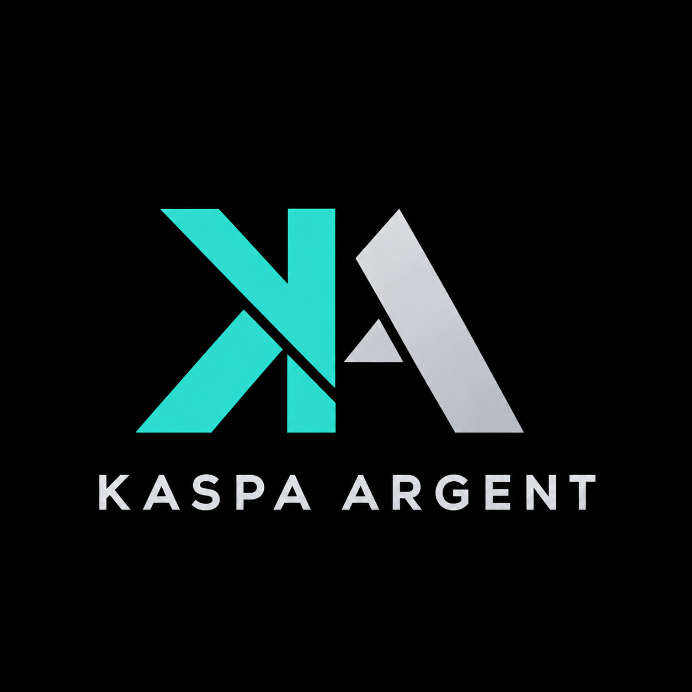

# Argent Studio



A Tauri desktop editor for Argent contracts, with a source editor, interactive structure view, compiler output, and local test transactions.

## Windows download

Download the Windows x64 installer from [GitHub Releases](https://github.com/KaspaHUB21/Argent-Studio/releases/latest). No separate JSON files or development tools are needed. Windows installers are currently unsigned; trusted publisher signing is pending certificate provisioning.

## macOS preview download

Download the macOS preview ZIP for Apple Silicon (arm64) or Intel (x64) from [GitHub Releases](https://github.com/KaspaHUB21/Argent-Studio/releases/latest). Extract the ZIP and move **Argent Studio.app** to **Applications**. The compiler, runtime and examples are included. These preview builds are not Developer ID signed or notarized; macOS may block the first launch. See [Apple's instructions](https://support.apple.com/102445) for opening an app you trust. macOS 13.5 or newer is required; automated native validation currently covers macOS 15 on both architectures. First-launch security prompts on a user Mac remain unverified.

## Features

- Projects, editable examples, named project duplication, and conflict-aware saving.
- Code highlighting, completion, folding, and linked source and structure views.
- Local compilation, generated artifacts, and transaction simulation with lossless integer values.
- Light and dark themes, English and German interface localization.
- Optional AI assistance, disabled by default. API credentials use the operating system credential store.

## Build from source

Install Node.js 22 or newer, pnpm, Rust 1.94 or newer, and the native Tauri build prerequisites for your operating system. Windows requires C++ build tools and WebView2. macOS requires Xcode command-line tools.

```sh
pnpm install --frozen-lockfile
node scripts/build-runtime.mjs
pnpm tauri dev
```

The runtime build compiles the vendored Argent compiler and local transaction runner, then copies the active Node executable into the runtime folder. Native helper binaries must be built on the target platform. Cargo and pnpm lockfiles pin dependencies; the first build requires network access to retrieve them.

For a production application bundle, provide the updater signing key using the Tauri signing environment variables (see docs/RELEASE.md):

```sh
pnpm tauri build
```

For an unpackaged desktop binary:

```sh
node scripts/build-desktop.mjs
```

Keep the `resources` directory alongside an unpackaged executable. Generated binaries, build outputs, caches, private projects, and user settings are excluded from this repository.

Windows and macOS 15 (Intel and Apple Silicon) have passed automated native tests. Mac downloads remain previews pending end-user installation validation and Apple signing/notarization.

## Projects and examples

Development projects use the local `projects` directory. Portable Windows builds use a `projects` directory beside the launcher or executable. macOS bundles use `Documents/Argent Studio/projects`. Set `ARGENT_PROJECTS_DIR` to an absolute directory to override this location.

Compilation uses the current project's build entry. A single Argent source is selected automatically; projects with multiple sources and no saved selection show a chooser. The selected relative path and optional application name are stored in `.argent-studio.json` on compilation or when explicitly selecting an entry. This hidden project file travels with copied or moved projects. Editor tab changes do not change the build entry.

The four examples are seeded from `resources/examples/catalog` without overwriting existing projects. Reopening an example reuses its existing folder. Use **Duplicate project** to create a separately named copy. Generated files belong in each project's `build` directory and are available from **Generated files**. Opening a project clears the previous project's output and errors and shows files from the newest saved build, if present. Saved builds are for inspection; test transactions compile current sources again. Keep recent builds and use the build cleanup action when needed.

## Continuous integration

[Windows build and tests](https://github.com/KaspaHUB21/Argent-Studio/actions/workflows/windows.yml) builds the installer and runs automated checks for every push to `main` and every pull request. See [docs/CI.md](docs/CI.md) for test artifacts and signing details.

## Tests

```sh
pnpm test
pnpm run test:services
cargo test --locked --manifest-path src-tauri/Cargo.toml
pnpm exec playwright test --workers=1
```

Browser tests use Microsoft Edge on Windows and WebKit on macOS. Compiler and transaction integration tests require the native helpers from `build-runtime.mjs`. Tests do not require paid API calls. Test output and screenshots are ignored by Git.

## Repository contents

- `frontend`: desktop web interface.
- `src-tauri`: native Rust application and configuration.
- `resources/assets/language`: local language and structure services.
- `resources/toolchains/argent-master`: vendored compiler and transaction runtime sources.
- `resources/examples/catalog`: public example templates, without build history.
- `scripts` and `tests`: build helpers and automated checks.

Documentation and file names are English. German strings in source files are interface translations and translation tests, retained for the bilingual application.

## License

Original application code is MIT licensed. Vendored components retain their own licenses. See [THIRD-PARTY-NOTICES.md](THIRD-PARTY-NOTICES.md).

Release verification and signing requirements are documented in [docs/RELEASE.md](docs/RELEASE.md).

## Application updates

Windows release builds and macOS preview builds check for updates at startup. Use **Updates** to check manually. Choose **Later** to dismiss a release, or **Update now** to save pending changes, download and verify the signed installer, and install the update. Version 0.45.1 and earlier require a one-time manual installation of an updater-enabled version. Update signatures are separate from Windows publisher signatures.
